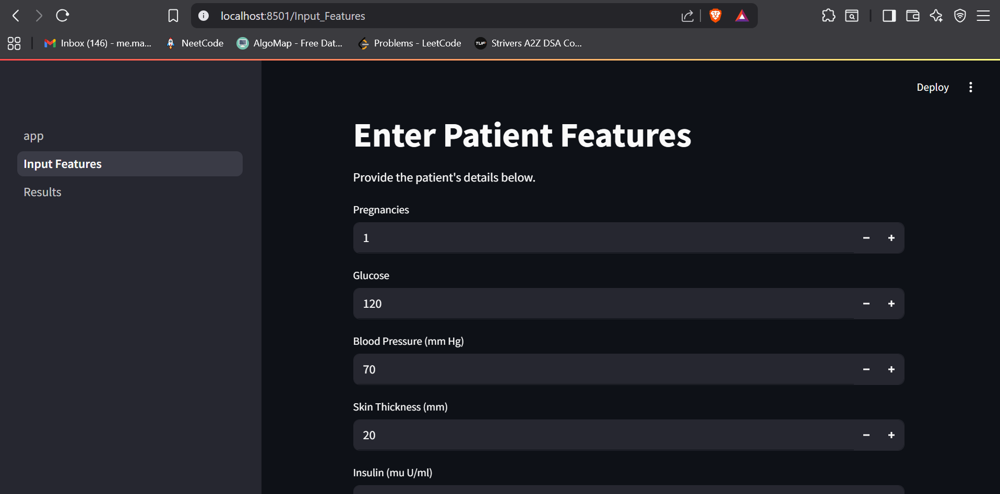
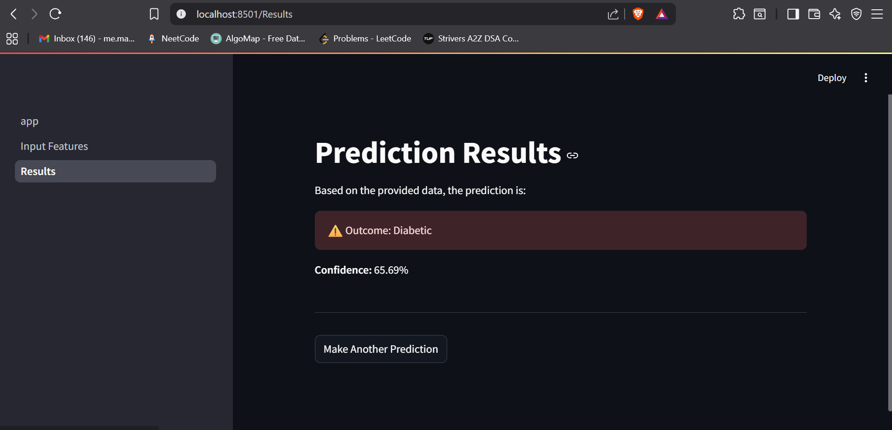

# 🩸 Diabetes Prediction App

A multi-page machine learning web application built with **Python** and **Streamlit** to predict the likelihood of a person having diabetes based on their health metrics.

📸 **Working Prototype**
---


---

## 🚀 Features

- **Multi-Page Web Interface**: A clean and intuitive user flow, separating the home, input, and results pages.
- **Accurate Prediction**: Predicts diabetes outcome based on a scientifically validated dataset.
- **Stateful Navigation**: Uses Streamlit's Session State to pass data between pages for a seamless experience.
- **Dynamic Results**: Displays the binary outcome ("Diabetic" / "Not Diabetic") along with the model's confidence score.
- **Easy to Run Locally**: Simple setup with a `requirements.txt` file for quick installation.

---

## 🧠 Concepts Used

### 1. Machine Learning

- **Dataset**: The model was trained on the **PIMA Indians Diabetes Dataset**, which contains health information from 768 female patients.
- **Model**: A **Random Forest Classifier** was used for its high accuracy and ability to handle the dataset's complexity. The training process is detailed in the `diabetes_prediction.ipynb` notebook.
- **Data Preprocessing**: A critical step was handling missing values. In the original data, features like `Glucose`, `Insulin`, and `BMI` had `0` as a placeholder for missing data. These zeros were replaced with the **mean** of the respective column to create a more realistic and accurate model.
- **Prediction**: The trained model (`diabetes_model.pkl`) infers the diabetes outcome from the 8 user-provided feature values.

### 2. Streamlit (Python Web Framework)

- **`app.py`**: Serves as the main home page for the application, providing a welcome message and instructions.
- **Multi-Page Structure**: Streamlit's native multi-page feature is used. Files placed in the `pages/` directory are automatically treated as separate pages, creating a clean navigation sidebar.
- **Model Loading**: Uses the `joblib` library to load the pre-trained `.pkl` model for fast and efficient predictions.
- **Session State**: `st.session_state` is used to store the prediction results on the input page and securely transfer them to be displayed on the results page.

---

## 🛠️ File Structure

diabetes_app/
├── static/
│   └── images/
│       ├── prototype.png
│       └── result_sample.png
├── pages/
│   ├── 1_Input_Features.py
│   └── 2_Results.py
├── .gitignore
├── app.py
├── diabetes.csv
├── diabetes_model.pkl
├── diabetes_prediction.ipynb
├── requirements.txt
└── README.md

---

## 💻 How to Run Locally

### ✅ Prerequisites

- Python 3.7+
- `pip` package manager

### 📦 Setup Instructions

1.  **Clone the repository:**
    ```bash
    git clone [https://github.com/](https://github.com/)<your-username>/diabetes-prediction-app.git
    cd diabetes-prediction-app
    ```
2.  **Create and activate a virtual environment (recommended):**
    ```bash
    # Create the environment
    python -m venv venv
    # Activate it
    source venv/bin/activate  # On Windows: venv\Scripts\activate
    ```
3.  **Install the required libraries:**
    ```bash
    pip install -r requirements.txt
    ```

### ▶️ Run the App

1.  Make sure you are in the main project directory in your terminal.
2.  Run the following command:
    ```bash
    streamlit run app.py
    ```
3.  The application will open automatically in your web browser.

---

## 📥 Input Features

The model requires the following 8 features to make a prediction:

| Feature                      | Description                                    | Type    |
| ---------------------------- | ---------------------------------------------- | ------- |
| **Pregnancies** | Number of times pregnant                       | Numeric |
| **Glucose** | Plasma glucose concentration a 2 hours         | Numeric |
| **Blood Pressure** | Diastolic blood pressure (mm Hg)               | Numeric |
| **Skin Thickness** | Triceps skin fold thickness (mm)               | Numeric |
| **Insulin** | 2-Hour serum insulin (mu U/ml)                 | Numeric |
| **BMI** | Body mass index (weight in kg/(height in m)^2) | Numeric |
| **Diabetes Pedigree Function**| A function that scores likelihood of diabetes | Numeric |
| **Age** | Age of the user (in years)                     | Numeric |

---

## 📤 Output

- **Outcome**: A binary classification indicating whether the person is **Diabetic** or **Not Diabetic**.
- **Confidence**: The probability score associated with the predicted outcome.

---

## 🔍 Example Screenshot



---

## 🙌 Credits

- **Dataset**: [PIMA Indians Diabetes Dataset](https://www.kaggle.com/datasets/uciml/pima-indians-diabetes-database) from Kaggle.
- **Developed by**: [Manav Goel](https://github.com/Manav0411)